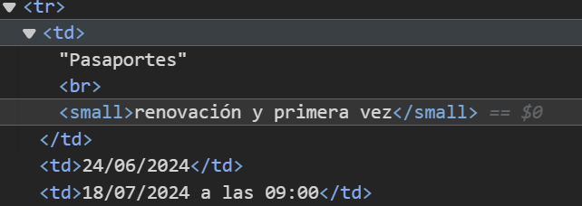

# pasaporte-consulado-espanol-BsAs
Dirty scraper para enterarte cuando hay citas disponibles.

Está hecho para ser corrido de manera local en Windows. Es conveniente correrlo como Scheduled Task al iniciar sesión:

1. En Task Scheduler ir a `Actions` > `Create Task`
2. en `General` ponerle un nombre a la tarea
3. `Triggers` > `At logon`
4. `Actions` >
  1. `Start a program`
  2. `Program/script`: full path al python executable
  3. `Arguments`: nombre del script de python (en este caso: `check_citas_pasaporte.py`)
  4. `Start in`: full path al directorio en donde esta dicho script

Recomiendo usar el archivo `test.html` para hacer las pruebas y corroborar que funciona correctamente.

## Funcionamiento
Cada 5 minutos (300 segundos), checkea si la string target cambio en [sitio de citas del Consulado General de España en Buenos Aires](https://www.cgeonline.com.ar/informacion/apertura-de-citas.html).
Si hubo algún cambio, nos alerta con una notificación de Windows con sonido y pop up. Y seguidamente nos envía un mail (en este caso uso una cuenta de Gmail, con una app password; ver: http://myaccount.google.com/apppasswords)

El ejemplo está hecho para 'Pasaporte renovación y primera vez' [ver nota 1]. En caso de necesitarlo para otro trámite hay que cambiar esa string que correponde a la fila de la tabla en html. Ver imagen a continuación:

Notas:
[1] En el script la string aparece como `"Pasaportesrenovación y primera vez"` porque el tag ` ` no tiene cierre (` `) entonces lo parsea así. Eso es una desprolijidad más del sitio del consulado. Hay que ser muy artesanal con este tipo de cosas. Lo importante es que funciona.
